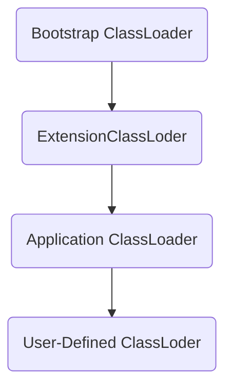

---

title: Java 类加载与实例化
date: 2020/2/19
description: 本文介绍 Java 加载一个类的基本步骤与类的实例化、变量初始化过程，以及类加载器的分类、功能和委派模式
tag: [Java Core, Java]

---

# Java 类加载与实例化

## 基本步骤

类装载分为以下 5 个步骤：

- 加载：根据查找路径找到相应的 class 文件然后导入
- 检查：检查加载的 class 文件的正确性
- 准备：给类中的静态变量分配内存空间
- 解析：虚拟机将常量池中的符号引用替换成直接引用的过程。符号引用理解为一个标识，而直接引用直接指向内存中的地址
- 初始化：对静态变量和静态代码块执行初始化工作

## 加载过程

```java
public class ClassLoadTest {
    public static int k = 0;
    public static ClassLoadTest t1 = new ClassLoadTest("t1");
    public static ClassLoadTest t2 = new ClassLoadTest("t2");
    public static int i = print("i");
    public static int n = 99;
    public int j = print("j");
    {
        print("构造块");
    }
    static {
        print("静态块");
    }
    public ClassLoadTest(String str) {
        System.out.println((++k) + ":" + str + "    i=" + i + "  n=" + n);
        ++n;
        ++i;
    }
    public static int print(String str) {
        System.out.println((++k) + ":" + str + "   i=" + i + "   n=" + n);
        ++n;
        return ++i;
    }
    public static void main(String[] args) {
        new ClassLoadTest("ClassLoadTest");
    }
}
```

print

```java
1:j   i=0   n=0
2:构造块   i=1   n=1
3:t1    i=2  n=2
4:j   i=3   n=3
5:构造块   i=4   n=4
6:t2    i=5  n=5
7:i   i=6   n=6
8:静态块   i=7   n=99
9:j   i=8   n=100
10:构造块   i=9   n=101
11:ClassLoadTest    i=10  n=102  
```


### 示例分析

- 执行 main 时，先加载所在类，声明静态变量，并初始化静态变量执行静态代码块（按顺序执行）
- 初始化到 t1 时，**暂停类加载**，先实例化，此时 k=0，而 i，n 都未初始化，系统默认值为 0
  初始化 j 时， k 自增为 1，i，n 为0，输出 “1:j i=0 n=0”，n,i 自增为 1
  执行代码块，输出 “2:构造块 i=1 n=1”，n,i 自增为 2
  执行构造函数，输出 “3:t1 i=2 n=2”，n,i 自增为 3
- 初始化到 t2 时，**暂停类加载**，先实例化，此时 k=3，i，n 都还未初始化，但已自增为 3
  初始化 j 时，k 自增为 4，i，n 未初始化为 3，输出 “4:j i=3 n=3”，n,i 自增为 4
  执行代码块，输出 “5:构造块 i=4 n=4”，n,i 自增为 5
  执行构造函数，输出 “6:t2 i=5 n=5”，n,i 自增为 6
- 初始化 i，输出 “7:i i=6 n=6”，n,i 自增为 7，返回自增后的i赋值给 i
- 初始化 n，赋值 99
- 执行静态块，输出 “8:静态块 i=7 n=99”，i 自增为 8，n 自增为 100

### 类加载过程

加载某类前先加载其父类  
加载某类时，先声明静态成员变量，初始化为默认值，再初始化静态成员变量执行静态代码块  
初始化静态成员变量执行静态代码块时，是按顺序执行（初始化静态成员变量的本质就是静态代码块）

>在某类加载过程中调用了本类实例化过程（如new了本类对象），则会暂停类加载过程先执行实例化过程，执行完毕再回到类加载过程

### 实例化过程

对某类实例化前，先对其父类进行实例化  
实例化某类时，先声明成员变量，初始化为默认值，再初始化成员变量执行代码块  
初始化成员变量执行代码块时，是按顺序执行

### 类的主动与被动使用

1. 主动使用场景
   - 最为常用的 new 一个类的实例对象
   - 直接调用类的静态方法
   - 操作该类或接口中声明的非编译期常量静态字段
   - 反射调用一个类的方法
   - 初始化一个类的子类的时候，父类也相当于被程序主动调用了（如果调用子类的静态变量是从父类继承过并没有复写的，那么也就相当于只用到了父类的东东，和子类无关，所以这个时候子类不需要进行类初始化）
   - 直接运行一个main函数入口的类

> 所有的 JVM 实现，在首次主动使用某类的时候才会加载该类。

2. 被动使用场景
   - 子类调用父类的静态变量，子类不会被初始化。只有父类被初始化。对于静态字段，只有直接定义这个字段的类才会被初始化
   - 通过数组定义来引用类，不会触发类的初始化，如`SubClass[] sca = new SubClass[10]`
   - 访问类的编译期常量，不会初始化类

### 编译期常量

1. 写到类常量池中的类型是有限的：String 和几个基本类型

   String 值为 null 时，也会写到类常量池中  
   使用 new String("xx") 创建字符串时，得到的字符串不是类常量池中的

2. 对于通过 new 产生一个字符串（假设为 ”china” ）时，会先去常量池中查找是否已经有了 ”china” 对象，
   如果没有则在常量池中创建一个此字符串对象，然后堆中再创建一个常量池中此 ”china” 对象的拷贝对象。

### 变量初始化

1. 普通成员变量在声明时、代码块、构造方法中可以被初始化
2. 静态变量在声明时、静态块中可以被初始化
3. 成员变量有默认的初始值

```java
byte:0(8位)
short:0(16位)
int:0(32位)
long:0L(64位)
char:\u0000(16位)，代表NULL
float:0.0F(32位)
double:0.0(64位)
boolean: flase
```

4. 局部变量声明以后，java 虚拟机不会自动的初始化为默认值

> 因此对于局部变量，必须先经过显示的初始化，才能使用。如果编译器确认一个局部变量在使用之前可能没有被初始化，编译器将报错

## 类加载器

### 分类



1. 启动类加载器，Bootstrap classLoader（jre\lib\rt.jar 包括 java.lang 等核心类库）

   当运行 java 虚拟机时，这个类加载器被创建，它加载一些基本的 java API，包括 Object 这个类。需要注意的是，这个类加载器是用 C/C++ 实现的

2. 扩展类加载器，Extension class loader（jre\lib\ext\ *.jar 等）

   这个加载器加载出了基本API之外的一些拓展类，包括一些与安全性能相关的类

3. 应用程序类加载器，Application ClassLoader（classpath 指定内容）

   它加载应用程序中的类，也就是在 classpath 中配置的类

4. User-Defined ClassLoader

   开发人员通过拓展 ClassLoader 类定义的自定义加载器，加载程序员定义的一些类

### 功能

1. 负责加载字节码文件，class 文件在文件开头有特定的文件标示，并且 ClassLoader 负责 class 文件的加载等，至于它是否可以运行，则由 Execution Engine 决定

2. 主要功能
   
   - 定位和导入二进制 class 文件
   
   - 验证导入类的正确性
   - 为类分配初始化内存
   - 帮助解析符号引用

### 委派模式

1. 自下而上检测是否已经加载类

   当 JVM 加载一个类的时候，下层的加载器会将任务委托给上一层类加载器，上一层加载检查它的命名空间中是否已经加载这个类，如果已经加载，直接使用这个类。如果没有加载，继续往上委托直到顶层

2. 由上而下尝试加载类

   检查完毕没有加载该类，则按照相反的顺序进行加载，如果 Bootstrap 加载器找不到这个类，则往下委托，直到找到类文件。对于某个特定的类加载器来说，一个 java类 只能被载入一次，也就是说在 java 虚拟机中，类的完整标识是（classLoader，package，className）
   
   > 在 java 中**任意一个类都是由这个类本身和加载这个类的类加载器来确定这个类在JVM中的唯一性**

3. 优点

   使得类有了层次的划分。就拿 java.lang.Object 来说，加载它经过一层层委托最终都由 Bootstrap ClassLoader 去找 jre\lib 中 rt.jar 里面的 java.lang.Object 并加载到 JVM 中。如果有不法分子自己构造了一个 java.lang.Object，里面嵌了不好的代码，按照双亲委派模型来实现的话，最终加载到 JVM 中的只会是 rt.jar 里面的东西，也就是说这些核心的基础类代码得到了保护
