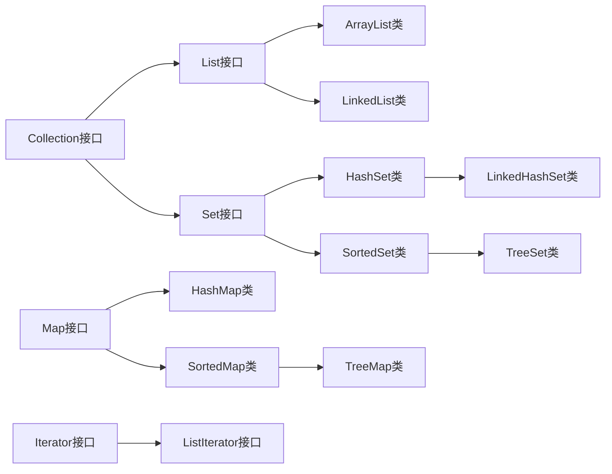

---

title: Java 集合与容器类
date: 2020/2/20
description: 集合与容器类是 Java 开发过程中的重要内容，本文介绍 Java 容器框架中常见的接口、抽象类、派生类以及 Conllections、迭代器、比较器等
tag: [Java Core, Java]

---

# Java 集合与容器类

## 体系

早在 Java 2 中之前，Java 就提供了特设类。比如：Dictionary, Vector, Stack 和 Properties 这些类用来存储和操作对象组。虽然这些类都非常有用，但是它们缺少一个核心的，统一的主题。由于这个原因，使用 Vector 类的方式和使用 Properties 类的方式有着很大不同。为此，整个集合框架就围绕一组标准接口而设计。

集合框架被设计成要满足以下几个目标。

- 该框架必须是高性能的。基本集合（动态数组，链表，树，哈希表）的实现也必须是高效的。
- 该框架允许不同类型的集合，以类似的方式工作，具有高度的互操作性。
- 对一个集合的扩展和适应必须是简单的。




## 接口

### Collection

1. 最基本的集合接口，存储一组不唯一、无序的对象

2. 公共方法

   |                  方法                  |                描述                 |
   | :------------------------------------: | :---------------------------------: |
   |               int size()               |            返回元素个数             |
   |           boolean isEmpty()            |            判断是否为空             |
   |      boolean contains(Object obj)      |          判断是否包含 obj           |
   |         boolean add(E element)         |       添加元素，返回成功与否        |
   |             int hashCode()             |             返回哈希码              |
   |           Object[] toArray()           |         转换为 Object 数组          |
   |       boolean remove(Object obj)       |              删除元素               |
   |              void clear()              |              清空容器               |
   |          Iterator<E> iterator          |             返回迭代器              |
   |        boolean equals(Object o)        |            是否与 o 相等            |
   |      void shuffle(List< ? > list)      |            随机重排元素             |
   | boolean containsAll(Collection< ? > c) |      判断是否包含 c 中所有元素      |
   |     boolean addAll(Contain< ? > c)     |             集合并运算              |
   |  boolean removeAll(Collection< ? > c)  |             集合差运算              |
   |  boolean retainAll(Collection< ? > c)  | 集合交运算，只保留也被 c 包含的元素 |

### Map

1. 存储键值对，提供 key 到 value 的映射，key 唯一

2. 公共方法

   |                    方法                     |        描述        |
   | :-----------------------------------------: | :----------------: |
   |            V put(K key,V value)             |     插入键值对     |
   | void putAll(Map<? extends K,? extends V> m) |      复制映射      |
   |       boolean containsKey(Object key)       |  判断是否包含 key  |
   |     boolean containsValue(Object value)     | 判断是否包含 value |
   |              V get(Object key)              |    返回键对应值    |
   |               Set<K> keySet()               |    返回键的集合    |
   |           Collection<V> values()            |    返回值的集合    |
   |            V remove(Object key)             | 删除 key 对应条目  |
   |       Set<Map.Entry<K,V>> entrySet()        |  返回键值对的集合  |

   > 使用 keySet() 抽取 key 序列，将 map 中的所有 key 生成一个 Set。
   >
   > 使用 values() 抽取 value 序列，将 map 中的所有 values 生成一个 Collection。
   >
   > 为什么一个生成 Set，一个生成 Collection？那是因为，key 总是独一无二的，value 允许重复。

### List

1. Collection 的子接口，通过索引访问元素，存储一组不唯一、有序的对象

2. 公共方法

   |                        方法                         |                描述                |
   | :-------------------------------------------------: | :--------------------------------: |
   |                  E get(int index)                   |          返回指定位置元素          |
   |             E set(int index,E element)              |    替换指定位置，返回被取代元素    |
   |                int indexOf(Object o)                | 返回 o 首次出现序号，不存在返回 -1 |
   |              int lastIndexOf(Object o)              |        返回 o 最后出现序号         |
   |            void add(int index,E element)            |            指定位置插入            |
   |               boolean add(E element)                |            最后位置插入            |
   |                 E remove(int index)                 |       删除并返回指定位置元素       |
   |      boolean addAll(Collection<? extends E> c)      |     列表最后添加 c 中所有元素      |
   | boolean addAll(int index,Collection<? extends E> c) |     指定位置添加 c 中所有元素      |
   |           ListIterator<E> listIterator()            |             返回迭代器             |
   |       ListIterator<E> listIterator(int index)       |      返回指定位置开始的迭代器      |

   

### Set

1. Collection 的子接口，不保存重复元素，存储一组唯一、无序的对象
2. 公共方法：继承自 Collection，未声明其他方法，不提供 get 方法获取元素

## 实现类

### List派生类

2. ArrayList
   - 数组列表，自动扩容，增长长度为原来的 50%  

   - 基于数组，随机访问、遍历效率高，插入删除效率低

   - 可插入 null

2. LiinkedList

   - 链式数据结构

   - 基于双向链表，插入删除效率高，随机访问、查找效率低

   - 可插入 null

   - 常用方法

     |           方法            |        描述        |
     | :-----------------------: | :----------------: |
     | public void addFirst(E e) |      插入开头      |
     | public void addLast(E e)  |      插入尾部      |
     |    public E getFirst()    |    返回第一元素    |
     |    public E getLast()     |    返回最后元素    |
     |  public E removeFirst()   | 删除并返回第一元素 |
     |   public E removeLast()   | 删除并返回最后元素 |


### Map派生类

1. HashMap

   - 查找元素的时间复杂度 O(1)
   - 允许 null 键和 null 值
   - 键必须唯一，值可以重复，无序
   - 上座率：元素个数达到容量与上座率乘积时，容量自动翻倍

2. TreeMap

   - 基于二叉搜索树，查找元素时间复杂度 O(logn)

   - 实现了 SortedMap 接口

   - 不允许 null 键（空指针异常），允许 null 值

   - 键必须唯一，值可以重复，按键值从大到小排列
   
   - 常用方法
   
     |                  方法                  |             描述              |
     | :------------------------------------: | :---------------------------: |
     |          public K firstKey()           |          返回最低键           |
     |           public K lastKey()           |          返回最高键           |
     | public SortedMap<K,V> headMap(K toKey) | 返回键值小于 toKey 那部分映射 |
     | public SortedMap<K,V> tailMap(K toKey) | 返回大于等于 toKey 那部分映射 |
     |        public K lowerKey(K key)        |    返回小于给定键的最大键     |
     |        public K floorKey(K key)        |  返回小于等于给定键的最大键   |
     |       public K higherKey(K key)        |    返回大于给定键的最小键     |
     |       public K ceilingKey(K key)       |  返回大于等于给定键的最小键   |

### Set派生类

1. HashSet

   - 内部封装了一个 HashMap，HashSet 作为 map 的 key 而存在，value 则是一个类属性
   - 允许 null 元素
   - 不能添加重复元素，方法添加重复对象时不改变集合返回 false
   - 无序，不按插入顺序，也不按 HashCode 顺序
   - 常用方法

   |               方法                |          描述          |
   | :-------------------------------: | :--------------------: |
   |      public boolean add(E e)      | 添加对象，返回成功与否 |
   |        public void clear()        |        清空集合        |
   | public boolean contains(Object o) |  判断是否包含 o 元素   |
   |         public int size()         |      返回集合容量      |

2. TreeSet

   - 基于 TreeMap 的键实现，实现 了SortedSet 接口
   - 不允许插入 null 元素（空指针异常）
   - 按元素从小到大排序
   - 不能添加重复元素
   - 常用方法
   |               方法               |           描述            |
   | :------------------------------: | :-----------------------: |
   |         public K first()         |       返回最低元素        |
   |         public K last()          |       返回最高元素        |
   | public SortedSet<E> headSet(E e) |   返回小于 e 那部分映射   |
   | public SortedSet<E> tailSet(E e) | 返回大于等于 e 那部分映射 |
   |       public E lower(E e)        |    返回小于 e 最大元素    |
   |       public E floor(E e)        | 返回小于等于 e 的最大元素 |
   |       public E higher(E e)       |   返回大于 e 的最小元素   |
   |      public E ceiling(E e)       | 返回大于等于 e 的最小元素 |


3. LinkedHashset

   - 继承自 HashMap，内部加入链表保存元素顺序
   
   - 基于元素进入集合的顺序或者被访问的顺序排序

### 传统类

1. HashTable
   - Dictionary 的子类，实现了 Map 接口
   - 不允许 null 键，不允许 null 值
   - 键必须唯一，值可以重复，无序
   - 线程安全，支持同步
   
2. Vector
   - 线程安全，同步访问
   - 继承自 AbstractList
   
3. Properties
   - 继承自 HashTable，实现了 Map 接口
   
   - 表示一个持久的属性集，属性列表中每个键及其对应值都是一个字符串
   
   - 常用方法
   
     |                        方法                        |             描述             |
     | :------------------------------------------------: | :--------------------------: |
     |           String getProperty(String key)           |      返回指定键对应属性      |
     |    Object setProperty(String key, String value)    |  调用 Hashtable 的 put 方法  |
     |          void list(PrintStream streamOut)          | 将属性列表输出到指定的输出流 |
     |          void list(PrintWriter streamOut)          | 将属性列表输出到指定的输出流 |
     | void load(InputStream streamIn) throws IOException |    从输入流中读取属性列表    |
   
     ```java
     //加载 properties 配置文件的两种方法,JDBCUtils 为例
     //方法一
     URL res = JDBCUtils.class.getClassLoader().getResource("jdbc.properties");
     String path = res.getPath();
     pro.load(new FileReader(URLDecoder.decode(path, "utf-8")));
     //方法二
     // InputStream is = JDBCUtils.class.getClassLoader().getResourceAsStream("jdbc.properties");
     InputStream is = JDBCUtils.class.getResourceAsStream("/jdbc.properties");
     pro.load(is);
     ```
   
4. Stack

   - 继承自 Vector ，先进后出

   - 线程安全

   - 常用方法

     |            方法             |         描述          |
     | :-------------------------: | :-------------------: |
     |       boolean empty()       |     判断是否栈空      |
     |        Object peek()        | 查看栈顶元素，不删除  |
     |        Object pop()         | 删除栈顶元素，并返回  |
     | Object push(Object element) |       元素压栈        |
     | int search(Object element)  | 返回位置，以 1 为基数 |

5. Dictionary 

   - 抽象类，用来存储键/值对，作用和Map类相似

6. BitSet

   - 位集合， 按需增长的位向量 

   -  使用场景：整数，无重复 

   -  每一位的值都是一个 boolean 值 ，占用一 bit（不是一字节）

   - 内部基于 long 数组， 所以 BitSet 的大小为 long 类型大小(64位)的整数倍 

   - 常用方法
   
     |                       方法                        |                 描述                 |
     | :-----------------------------------------------: | :----------------------------------: |
     |                void set(int index)                |     将指定索引处的位设置为 true      |
     |          void set(int index, boolean v)           |     将指定索引处的位设置为指定值     |
     |      void set(int startIndex, int endIndex)       | 将范围内的位设置为 true（左开右闭）  |
     | void set(int startIndex, int endIndex, boolean v) | 将范围内的位设置为指定值（左开右闭） |
     |              boolean get(int index)               |         返回指定索引处的位值         |
   
     

## 算法

### Collections

|                      方法                      |                    描述                     |
| :--------------------------------------------: | :-----------------------------------------: |
|          Collections.reverse(List l)           |                    反转                     |
|          Collections.shuffle(List l)           |                    混淆                     |
|           Collections.sort(List l）            |                    排序                     |
| Collections.swap(List l,int index1,int index2) |              替换下标位置元素               |
|      Collections.rotate(List l,int step)       |          向右滚动 ，尾部移动到开头          |
|         Collections.synchronizedList()         |                 线程安全化                  |
|       Collections.fill(List l,Object o)        |                    填充                     |
|        Collections.copy(List m,List n)         | n 中的元素复制到 m 中，并覆盖相应索引的元素 |

### 迭代器

1. Collection 定义了 toArray()、iterator()、size()方法，但并非所有实现类都重写了这些方法，Set 不提供 get 方法，不能使用 size() 方式遍历。

   ```java
   //Set 遍历方式
   Set<String> set = new HashSet<String>();
   //迭代器遍历
   Iterator<String> it = set.iterator();
   while (it.hasNext()) 
   {
     String str = it.next();
     System.out.println(str);
   }
   
   //for循环遍历：
   for (String str : set) 
         System.out.println(str);
   
   ```

   

2. Iterator 接口常用方法

   |               方法                |         描述         |
   | :-------------------------------: | :------------------: |
   | public abstract boolean hasNext() | 判断是否还有后续元素 |
   |     public abstract E next()      |     返回后续元素     |
   |   public abstract void remove()   |   删除当前指向元素   |

3. ListIterator 接口常用方法

   |                  方法                  |                   描述                   |
   | :------------------------------------: | :--------------------------------------: |
   | public abstract boolean hashPrevious() |            判断是否有前驱元素            |
   |      public abstract E previous()      |               返回前驱元素               |
   |        public abstract add(E e)        | 插入 next() 返回值之前，previoous() 之后 |
   |        public abstract set(E e)        |             替换当前指向元素             |
   |    public abstract int nextIndex()     |         返回基于 next() 元素序号         |
   |  public abstract int previousIndex()   |       返回基于 previous() 元素序号       |

### 比较器

1. Comparator类：一个类有多个属性，不知道按哪个属性进行排序时，通过 Comparator 类重写 compare(Object o1,Object o2 )指定比较算法，再利用 Collections.sort(List l,Comparator c) 进行排序
2. Comparable接口：实现接口，重写 compareTO(Object another) 方法，利用 Collections.sort(List l）排序

### Arrays

1. 数组复制

   1. ```java
      public static <T,U> T[] copyOfRange(U[] original, int from, int to)
      ```

      original：原数组	from：原数组的起始位置	to：终点位置（不包括） 

   2. ```java
      public static <T> T[] copyOf(T[] original, int newLength)
      ```

      original：原数组	newLength：要复制的长度 

      > StringBuider 中底层数组的扩容使用了 copyOf()
      >
      > copyOf() 内部是通过 System.arraycopy() 实现的

   3. ```java
      System.arraycopy(Object src, int srcPos, Object dest, int destPos, int length)
      ```

      src：原数组	srcPos：原数组起始位置	

      dest：目标数组	destPost：目标数组的起始位置	length：复制长度 

      > List 中的 remove 方法使用了 arraycopy()

2. 其他方法

|                          方法                           |     描述     |
| :-----------------------------------------------------: | :----------: |
|             public static String toString()             | 转换为字符串 |
|                public static void sort()                |     排序     |
| public static int binarySearch(Object[] a, Object key ) |     搜索     |
|    public static boolean equals(long[] a, long[] b)     | 判断是否相同 |
|       public static void fill(int[] a, int val))        |     填充     |

### HashCode

> 哈希集合查找元素为时间复杂度为 O(1) 的原理

1. 获得散列值：

   通过特定的哈希函数，每个对象都有对应的哈希值、

2. hashcode对应到内存地址：

   可以使用一个数组 array，将要存的数据放在 array[hashcode] 位置上

3. 哈希碰撞

   通过哈希方法，两个不同的元素，获得了相同的哈希值

   最常用用的解决办法是拉链法，在同一地址上建立链表来存储多个 hashcode 相同的元素

4. 查找

   通过哈希值找到地址，若地址上有多个元素，则用 equals 判断存储位置是否相同

   > 对于哈希集合来说，如果重写了元素对应的 equals() 方法或 hashcode() 方法中的一个，也必须重写另一个
