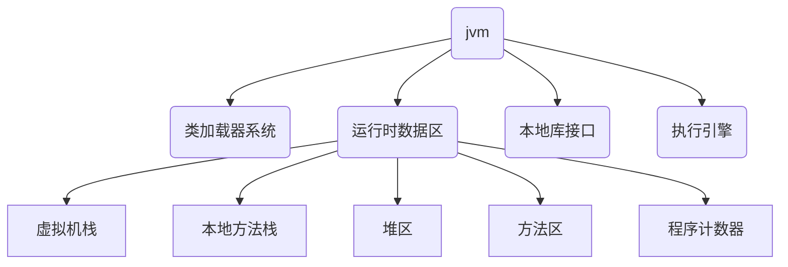

---

title: JVM 内存结构
date: 2020/2/25
description: 本文介绍 JVM 内存结构的基本划分情况，以及运行时数据区中堆区、栈区、方法区、计数器等的基本概念与功能
tag: [Java Core, JVM, Java]

---

# JVM 内存结构

## 划分情况图

## 运行时数据区

> 从整个计算机内存中开辟一块内存存储 jvm 运行时需要用到的对象，变量等 

### 虚拟机栈

1. 线程私有
2. 服务于方法
3. 用于存储局部变量表、操作数栈、动态链接、方法出口等信息

### 本地方法栈

1. 线程私有
2. 为虚拟机调用 Native 方法服务

### 堆区

1. 线程共享
2. 存储对象实例，是虚拟机中内存最大的一块
3. 分为年轻代、年老代、持久代（JDK8 中废弃），年轻代用来存放新对象，当对象存活时间够长时，移动到年老代

### 方法区

1. 线程共享
2. 用于存储已被虚拟机加载的类信息、常量、静态变量、即时编译后的代码等数据
3. jdk7 及以往版本，方法区基于堆的永久代实现，理论上是堆的一部分
4. jdk8 取消了永久代，在本地内存中划分区域-元空间，不属于 JVM 内存，方法区位于元空间中
5. 包括运行时常量池和 class 文件常量池

### 程序计数器

1. 线程私有
2. 是当前线程所执行的字节码的行号指示器
3. 字节码解析器的工作是通过改变这个计数器的值，来选取下一条需要执行的字节码指令
4. 分支、循环、跳转、异常处理、线程恢复等基础功能，都需要依赖这个计数器来完成

## 执行引擎

1. 解释器：解释执行经过编译后生成的字节码文件
2. 即时编译器 JIT： 收集一些代码的执行信息（预热过程）之后，将频繁执行的代码（热点代码）直接编译成本地机器码
3. 垃圾收集器：java 虚拟机自动进行内存管理，根据垃圾收集算法，清理无用对象

## 本地库接口

1. 本地接口的作用是融合不同的编程语言为 Java 所用，它的初衷是融合 C/C++ 程序，Java 诞生的时候 C/C++ 横行，要想立足，必须可以调用 C/C++ 程序，于是就在内存中专门开辟了一块区域处理标记为 native 的代码
2. 它的具体作法是 Native Method Stack 中登记 native 方法，在 Execution Engine 执行时加载本地方法库
3. 目前该方法使用的越来越少了，除非是与硬件有关的应用，比如通过 Java 程序驱动打印机，或者 Java 系统管理生产设备，在企业级应用中已经比较少见。因为现在的异构领域间的通信很发达，比如可以使用 Socket 通信，也可以使用 Web Service 等

## 类加载器系统

1. 负责加载字节码文件，class 文件在文件开头有特定的文件标示，并且 ClassLoader 负责 class 文件的加载等，至于它是否可以运行，则由 Execution Engine 决定
2. 主要功能
   - 定位和导入二进制 class 文件
   -  验证导入类的正确性
   -  为类分配初始化内存
   -  帮助解析符号引用
