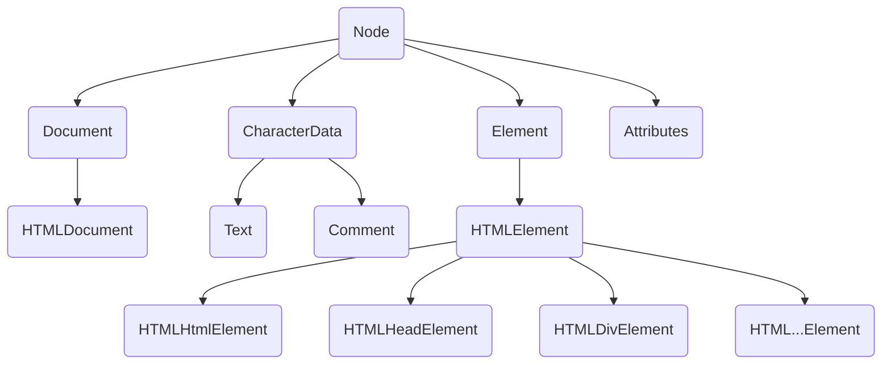

---

title: JavaScript DOM 基础
date: 2020/3/30
description: 本文介绍 JavaScript DOM 的含义、元素和节点的概念、以及使用 DOM API 遍历元素或节点、操作 DOM 树的方法等
tag: [前端基础, JavaScript]

---


# JavaScript DOM 基础

## DOM 的含义

1. DOM 即 document object model，文档对象模型

2. JavaScript 中有三类对象

   本地对象 Native Object

   ```javascript
   Object Function String Number Boolean
   Error EvalError SyntaxError TypeError RageError ReferenceError URIError
   Date RegExp
   ```

   内置对象 Built-in Object

   ```javascript
   Global: 一类对象的统称，是虚拟的，代表全局
   任何方法和属性都在对象之下
   如 isNaN()、parseInt、Number()、decodeURL() 等都是 Global 下的方法
   如 Math、Infinity、NaN、undefined 等都是 Global 下的属性
   本地对象、内置对象是 ECMAScript 的内部对象
   ```

   宿主对象 Host Object

   ```javascript
   执行 JS 的环境提供的对象，即浏览器对象
   window 对象 -> BOM，不同浏览器间没有固定规范
   document 对象 -> DOM，遵从 w3c 规范
   document 是 window 下的对象，即 BOM 包含 DOM
   ```

3. DOM 是通过浏览器提供的一套方法来操作 HTML 和 XML 文档

## 元素和节点

1. 节点包含元素，元素是节点的一部分，即元素节点

2. 节点分类

   元素节点、属性节点、文本节点、注释节点、文档节点等

3. 元素即元素对象，有 HTMLDivElement、HTMLInputElement、HTMLHtmlElement，继承自构造方法 HTMLElement，HTMLElement 继承自 Node，Node 即节点对象

4. document 继承自构造方法 HTMLDocument 的原型，HTMLDocument 继承自 Document 的原型

   ```javascript
   document.__proto__ -> HTMLDocument.prototype 
   HTMLDocument.prototype.__proto__ -> Document.prototype
   ```

## 获取元素

1. 通过 id 获取元素

    ```javascript
    document.getElementById(); // 返回对应的 HTMLElement 
    // 对于 getElementById()，IE8 及以下不区分大小写并且可以匹配 name
    ```

2. 通过类名获取元素集合

    兼容 IE9 及以上

    ```javascript
    document.getElementsByClassName(); // 返回元素集合 HTMLCollection
    ```

3. 通过标签名获取元素集合

    ```javascript
    document.getElementsByTagName(); // 返回元素集合 HTMLCollection
    ```

4. 通过 name 获取元素

    ```javascript
    document.getElementsByName(); // 返回元素集合 HTMLCollection
    // 常用于表单元素
    ```

5. 通过选择器获取对象

    兼容 IE8 及以上，是 HTML5 新加入的 web api

    ```javascript
    document.querySelector(); // 返回选择器选中的第一个节点对象 Node
    document.querySelectorAll(); // 返回选择器选中的节点列表 NodeList
    // querySelector、querySelectorAll 比 getElementById 等系列方法性能低
    ```

    > querySelectorAll 方法返回 NodeList，getElements 系列方法返回 HTMLCollection
    >
    > 前者是静态的，获取集合后，增加或删除内容，集合不改变，不具有实时性
    >
    > 而 HTMLCollection 是动态的，随文档操作而改变

## 遍历节点树

1. parentNode

   获取父节点

   ```javascript
   document.getElementsByTagName("html")[0].parentNode -> document
   // html 标签元素的 parentNode 是 document
   // 最高级节点是 document，document 的父节点是 null
   ```

2. childNodes

   获取子节点集合

   ```javascript
   document.getElementById("box").childNodes 
   // 包括元素节点、文本节点、注释节点在内
   ```

3. firstChild、lastChild

   获取第一个或最后一个子节点

   ```javascript
   document.getElementById("box").firstChild // 第一个子节点
   document.getElementById("box").lastChild // 第二个子节点
   ```

4. nextSibling、previousSibling

   获取上一个或下一个兄弟节点

   ```javascript
   document.getElementById("box").nextSibling // 上一个兄弟节点
   document.getElementById("box").previousSibling // 下一个兄弟节点
   ```

5. getAttributeNode()

   获取属性节点

   ```javascript
   document.getElementById("box").getAttributeNode("id") // 获取属性节点 id
   ```


## 遍历元素节点

1. parentElement

   获取父元素节点，兼容 IE9 及以上

   ```javascript
   document.getElementsByTagName("html")[0].parentElement -> null
   // html 标签元素的 parentElement 是 null
   ```

2. children

   获取子元素集合，IE6-8 还包含注释节点，IE9 及以上只包含元素节点

   ```javascript
   document.getElementById("box").children // 只包含元素节点
   document.getElementById("box").chilElementCount // children.length
   ```

3. firstElementChild、lastElementChild

   获取第或最后一个子元素节点，兼容 IE9 及以上

   ```javascript
   document.getElementById("box").firstElementChild // 第一个子元素节点
   document.getElementById("box").lastElementChild // 第二个子元素节点
   ```

4. nextElementSibling、previousElementSibling

   获取下一个或上一个兄弟元素节点，兼容 IE9 及以上

   ```javascript
   document.getElementById("box").nextElementSibling // 上一个兄弟元素节点
   document.getElementById("box").previousElementSibling // 下一个兄弟元素节点
   ```

## 节点的属性

1. nodeName

   返回节点名称、只读
   元素节点，元素名称大写

   ```javascript
   document.getElementById("box").nodeName // DIV
   // 文本节点 -> #text
   // 注释节点 -> #comment
   document.nodeName // #document
   // 文档节点 -> #document
   ```

2. nodeValue

   返回节点内容，可读写
   属性节点、文本节点、注释节点可用

   ```javascript
   document.getElementById("box").getAttributeNode('id').nodeValue // box
   document.getElementById("box").getAttributeNode('id').value // 效果相同
   ```

3. nodeType

   返回节点类型对应数字，只读

   ```javascript
   元素节点 1
   属性节点 2
   文本节点 3
   注释节点 8
   document 9
   DocumentFragment 11
   ```

   通过 nodeType 封装 childNodes，筛选出元素节点
   
   ```javascript
   function childElementArray(node) {
       var arr = [],
           nodes = node.childNodes;
       for (var i = 0; i < nodes.length; i++) {
           var item = nodes[i];
           if (item.nodeType === 1) {
               arr.push(item);
           }
       }
       return arr;
   }
   ```

4. attibutes

   返回元素节点的属性节点组成的类数组

   ```javascript
   document.getElementById("box").attributes[0].nodeValue // 获取第一个属性节点的 nodeValue
   ```

5. hasChildNodes

   返回是否有子节点的布尔值

## DOM 结构树



1. DOM 结构树显示了构造方法的继承关系与原型链的走向

2. Document 的原型被 HTMLDocument 继承，同样被 XMLDocument 继承

3. CharacterData 的原型是文本节点和注释节点的祖先

4. HTMLElement 下有与标签对应的多种 HTML...Element，用于构造元素节点

5. 需要注意的方法

   getElementById、getElementsByName 只在 Document 的原型上，只有 document 可以使用

   querySelector、querySelectorAll、getElementsByClassName、getElementsByTagName 在 Document 和 Element 的原型上都有，即 document 和元素节点对象都可以使用

   ```javascript
   var box = document.getElementById("box");
   box.getElementById("list"); // 报错
   ```

6. 需要注意的属性

   document.bady 、document.head、document.title 继承自 HTMLDocoment 的原型

   document.documentElement 继承自 Document 的原型

   ```javascript
   document.bady; // body 标签元素
   document.head; // head 标签元素， 兼容 IE9 及以上
   document.title; // title 元素内文字节点
   document.documentElement; // html 标签元素
   ```

## 节点相关操作

1. document.createElement()

   创建元素节点

   ```javascript
   var div = document.createElement("div"); // 传入标签名
   ```

2. document.createTextNode()

   创建文本节点

3. document.createComment()

   创建注释节点

4. document.createDocumentFragment()

   创建一个文档碎片，向其中添加节点，再将文档碎片插入文档中，可以提高性能

5. appendChild()

   在节点内部的最后添加子节点，并且具有剪切节点功能

   ```javascript
   var div = document.createElement("div"),
       text = document.creaetTextNode("文本");
   div.appendChild(text);
   document.body.appendChild(div);
   ```

6. insertBefore(a, b)

   在节点内部 a 节点之前插入 b 节点

   元素节点没有 insertAfter 方法，可以进行封装

   ```javascript
   Element.prototype.insertAfter = function (target, origin) {
           var after = origin.nextElementSibling; 
           if (after) {
           this.insertBefore(target, after);
       } else this.appendChild(target);
   }
   // nextElementSibling 兼容 IE9
   ```

6. removeChild()

   从文档中删除子节点，但内存中依然保留空间占用

7. remove()

   节点调用，删除自身，可以释放内存

8. replaceChild(a, b)

   用 a 节点替换子节点 b

9. innerHTML

   可以取值，可以赋值，并且赋值可以解析 HTML 代码

10. innerText

    可以取值，可以赋值，并且将赋值解析成文本节点，标签符号会被转码成字符实体

    firefox 老版本不支持，可使用功能相同的 textContent 

11. setAttribute()，getAttribute()

    设置、获取属性

    ```javascript
    var div = document.createElement("div");
    div.setAttribute('id', 'box');
    div.getAttribute('id'); // 返回 box
    ```

12. dataset

    HTML5 中以命名 `data-` 开头的属性，可以通过 dataset 方法访问

    兼容 IE9 及以上

    ```javascript
    // <p data-name="Jett" data-age="22"></p>
    document.getElementsByTagName("p")[0].dateset // {name: 'Jett', age: '22'}
    ```
